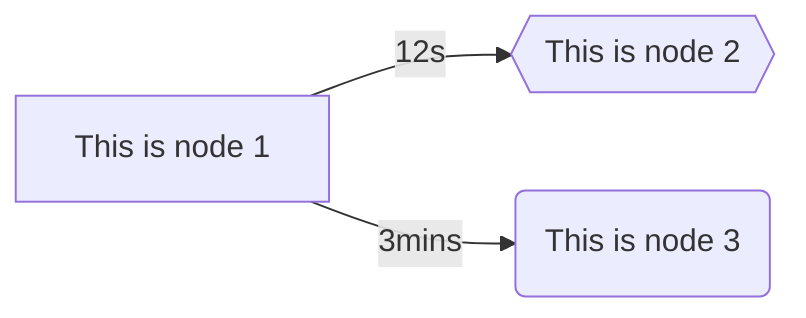
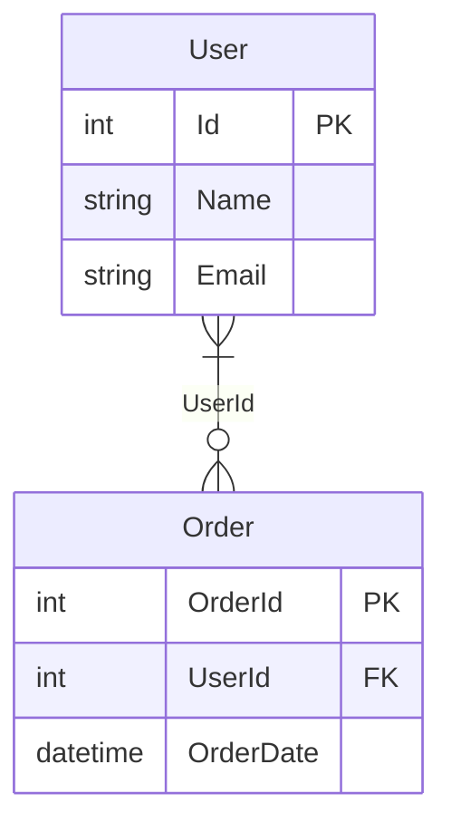
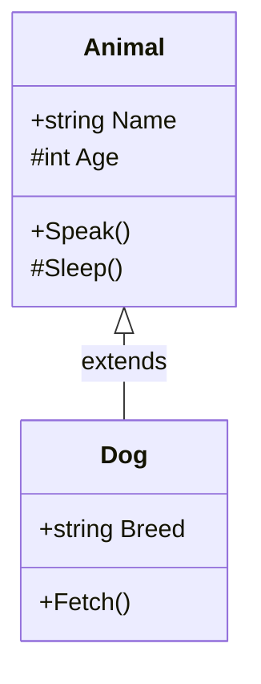

# MermaidDotNet
> **Info:** This project is a fork of the original [MermaidDotNet](https://github.com/samsmithnz/MermaidDotNet) repository. All enhancements, fixes, and additions are based on the initial project.

A comprehensive .NET wrapper to create [Mermaid](https://mermaid.js.org/) diagrams with full syntax support, including flowcharts, entity relationship diagrams, and class diagrams. These can be inserted into markdown or directly displayed in HTML with mermaid.js.

## Features

### Flowcharts
- **Directions**: LR (Left-Right), TD/TB (Top-Down/Top-Bottom), BT (Bottom-Top), RL (Right-Left)
- **Node Shapes**: Rectangle, Rounded, Stadium, Cylinder, Circle, Rhombus, Hexagon, Parallelogram, Trapezoid, TrapezoidAlt, Subroutine
- **Link Types**: Normal (--), Dotted (-.), Thick (==), Invisible (~~~)
- **Arrow Types**: Normal (>), Circle (o), Cross (x), Open (>)
- **Advanced Features**: CSS Classes, Click Actions, Bidirectional Links, Link Styling
- **Subgraphs**: Nested grouping with custom directions

### Entity Relationship Diagrams
- **Entities**: Define entities with columns including data types, keys (PK, FK, PK/FK), and comments
- **Relationships**: Support for relationship cardinality (Zero or One, One or More, Zero or More, Only One)
- **Column Types**: Support for all common data types and key constraints

### Class Diagrams
- **Classes**: Define classes with properties and methods
- **Visibility**: Public (+), Private (-), Protected (#), Package (~)
- **Relationships**: Inheritance, Composition, Aggregation, Association, Dependency
- **Namespaces**: Organize classes within namespaces
- **Methods**: Support for parameters and return types

## Flowchart Examples

### Basic Example

Very simple example, to create a Left->Right graph (LR), with two nodes linked. 
```csharp
    string direction = "LR";
    List<FlowNode> nodes = new()
    {
        new("node1", "This is node 1"),
        new("node2", "This is node 2", ShapeType.Hexagon),
        new("node3", "This is node 3", ShapeType.Rounded)
    };
    List<Link> links = new()
    {
        new Link("node1", "node2", "12s"),
        new Link("node1", "node3", "3mins")
    };
    Flowchart flowchart = new(direction, nodes, links);
    string result = flowchart.CalculateFlowchart();
```
The resultant mermaid code is shown below - which can be inserted into markdown in GitHub ([blog announcement](https://github.blog/2022-02-14-include-diagrams-markdown-files-mermaid/))

```
flowchart LR
    node1[This is node 1]
    node2{{This is node 2}}
    node3(This is node 3)
    node1--12s-->node2
    node1--3mins-->node3
```

When rendered in mermaid, the graph looks like this:


### Advanced Flowchart Example

Example with multiple node shapes, link types, arrow types, and styling:

```csharp
    string direction = "TD";
    List<FlowNode> nodes = new()
    {
        new("start", "Start Process", ShapeType.Circle, "startClass", "console.log('Started')"),
        new("process1", "Data Processing", ShapeType.Rectangle),
        new("decision", "Valid Data?", ShapeType.Rhombus),
        new("process2", "Transform Data", ShapeType.Parallelogram),
        new("end2", "Complete", ShapeType.Stadium)
    };
    List<Link> links = new()
    {
        new Link("start", "process1", "", null, false, LinkType.Normal),
        new Link("process1", "decision", "validate", null, false, LinkType.Dotted),
        new Link("decision", "process2", "yes", "stroke:green,stroke-width:3px", false, LinkType.Thick),
        new Link("process2", "end2", "", null, false, LinkType.Normal),
        new Link("decision", "process1", "", null, false, LinkType.Normal, ArrowType.Circle)
    };
    Flowchart flowchart = new(direction, nodes, links);
    string result = flowchart.CalculateFlowchart();
```

The advanced mermaid result:

```
flowchart TD
    start((Start Process))
    process1[Data Processing]
    decision{Valid Data?}
    process2[/Transform Data/]
    end2([Complete])
    start-->process1
    process1-.validate.->decision
    decision==yes==>process2
    process2-->end2
    decision--oprocess1
    linkStyle 0 stroke:green,stroke-width:3px
    class start startClass
    click start "console.log('Started')"
```

When rendered in mermaid, the advanced graph looks like this:


## Entity Relationship Diagram Examples

### Basic Entity Relationship Diagram

Example showing a simple database schema with users and orders:

```csharp
    var nodes = new List<EntityRelationNode>
    {
        new EntityRelationNode("User", new List<EntityRelationColumn>
        {
            new EntityRelationColumn("Id", "int", ColumnKeyType.PrimaryKey),
            new EntityRelationColumn("Name", "string"),
            new EntityRelationColumn("Email", "string")
        }),
        new EntityRelationNode("Order", new List<EntityRelationColumn>
        {
            new EntityRelationColumn("OrderId", "int", ColumnKeyType.PrimaryKey),
            new EntityRelationColumn("UserId", "int", ColumnKeyType.ForeignKey),
            new EntityRelationColumn("OrderDate", "datetime")
        })
    };
    var links = new List<EntityRelationLink>
    {
        new EntityRelationLink("User", "Order", "UserId", RelationType.OneOrMore, RelationType.ZeroOrMore)
    };
    var diagram = new EntityRelationshipDiagram();
    diagram.Nodes.AddRange(nodes);
    diagram.Links.AddRange(links);
    string result = diagram.CalculateDiagram();
```

The entity relationship mermaid result:

```
erDiagram
    User {
        int Id PK
        string Name
        string Email
    }
    Order {
        int OrderId PK
        int UserId FK
        datetime OrderDate
    }
    User }|--o{ Order : "UserId"
```

When rendered in mermaid:


## Class Diagram Examples

### Basic Class Diagram

Example showing a simple class hierarchy with inheritance:

```csharp
    var nodes = new List<ClassNode>
    {
        new ClassNode("Animal", properties: new List<ClassProperty>
        {
            new ClassProperty("Name", "string", ClassPropertyVisibility.Public),
            new ClassProperty("Age", "int", ClassPropertyVisibility.Protected),
        }, methods: new List<ClassMethod>
        {
            new ClassMethod(name: "Speak", visibility: ClassPropertyVisibility.Public),
            new ClassMethod(name: "Sleep", visibility: ClassPropertyVisibility.Protected),
        }),
        new ClassNode("Dog", properties: new List<ClassProperty>
        {
            new ClassProperty("Breed", "string", ClassPropertyVisibility.Public),
        }, methods: new List<ClassMethod>
        {
            new ClassMethod(name: "Fetch", visibility: ClassPropertyVisibility.Public),
        }),
    };
    var links = new List<ClassLink>
    {
        new ClassLink("Animal", "Dog", ClassLinkType.Inheritance, "extends")
    };
    var diagram = new ClassDiagram();
    diagram.Nodes.AddRange(nodes);
    diagram.Links.AddRange(links);
    string result = diagram.CalculateDiagram();
```

The class diagram mermaid result:

```
classDiagram
    class Animal {
        +string Name
        #int Age
        +Speak()
        #Sleep()
    }
    class Dog {
        +string Breed
        +Fetch()
    }
    Animal<|--Dog : extends
```

When rendered in mermaid:


## HTML Integration

```html
<h2>Mermaid Diagram</h2>
<body>
    Here is a mermaid diagram:
    <pre class="mermaid">
flowchart LR
    node1[This is node 1]
    node2{{This is node 2}}
    node3(This is node 3)
    node1--12s-->node2
    node1--3mins-->node3
    </pre>
    <script type="module">
        import mermaid from 'https://cdn.jsdelivr.net/npm/mermaid@10/dist/mermaid.esm.min.mjs';
        mermaid.initialize({ startOnLoad: true });
    </script>
</body>
```

## Sample Projects

### [MermaidDotNet.MVCWeb](src/MermaidDotNet.MVCWeb)

This is a sample ASP.NET Core MVC web application that demonstrates how to use the MermaidDotNet library to create and render Mermaid diagrams in an MVC web application. The project includes examples of creating flowcharts, entity relationship diagrams, and class diagrams using the Mermaid.js library.

### [MermaidDotNet.BlazorApp](src/MermaidDotNet.BlazorApp)

This is a sample Blazor application that demonstrates how to use the MermaidDotNet library to create and render Mermaid diagrams in a Blazor web application. The project includes examples of creating flowcharts, entity relationship diagrams, and class diagrams using the Mermaid.js library.
