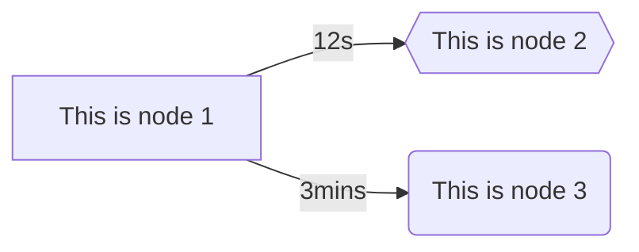
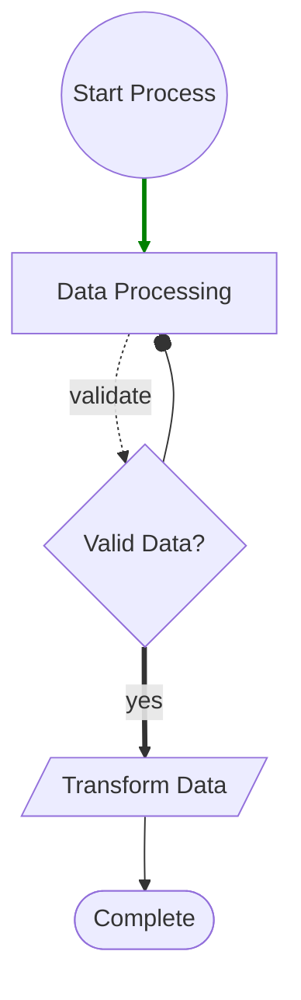
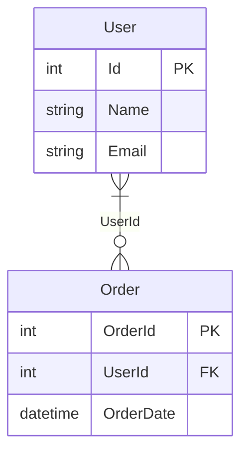
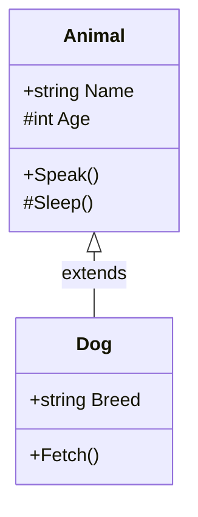
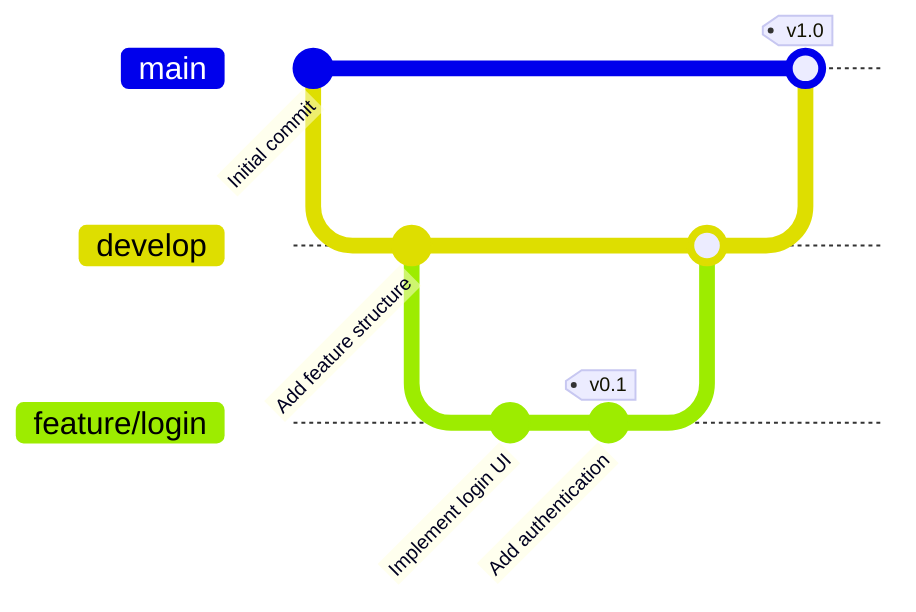

# MermaidSharp
[](https://www.nuget.org/packages/MermaidSharp)

> **Info:** This project is a fork of the original [MermaidDotNet](https://github.com/samsmithnz/MermaidDotNet) repository. All enhancements, fixes, and additions are based on the initial project.

MermaidSharp is a comprehensive .NET wrapper to create [Mermaid](https://mermaid.js.org/) diagrams with full syntax support, including flowcharts, entity relationship diagrams, and class diagrams. These can be inserted into markdown or directly displayed in HTML with mermaid.js.

## Features

### Flowcharts
- **Directions**: LR (Left-Right), TD/TB (Top-Down/Top-Bottom), BT (Bottom-Top), RL (Right-Left)
- **Node Shapes**: Rectangle, Rounded, Stadium, Cylinder, Circle, Rhombus, Hexagon, Parallelogram, Trapezoid, TrapezoidAlt, Subroutine
- **Link Types**: Normal (--), Dotted (-.), Thick (==), Invisible (~~~)
- **Arrow Types**: Normal (>), Circle (o), Cross (x), Open (>)
- **Advanced Features**: CSS Classes, Click Actions, Bidirectional Links, Link Styling
- **Subgraphs**: Nested grouping with custom directions

### Entity Relationship Diagrams
- **Entities**: Define entities with columns including data types, keys (PK, FK, PK/FK), and comments
- **Relationships**: Support for relationship cardinality (Zero or One, One or More, Zero or More, Only One)
- **Column Types**: Support for all common data types and key constraints

### Class Diagrams
- **Classes**: Define classes with properties and methods
- **Visibility**: Public (+), Private (-), Protected (#), Internal (~)
- **Relationships**: Inheritance, Composition, Aggregation, Association, Dependency, Realization
- **Namespaces**: Organize classes within namespaces
- **Methods**: Support for parameters and return types

### Git Graphs
- **Branches**: Create and manage multiple branches
- **Commits**: Add commits with optional identifiers and tags
- **Merges**: Merge branches with optional tag annotations
- **Checkouts**: Switch between branches
- **Configuration**: Customize main branch name and diagram appearance

## Getting Started

### Prerequisites
- .NET 8.0 SDK (required for core library and tests)
- .NET 9.0 SDK (required for sample applications)

### Installation

Restore and build the solution:
```bash
dotnet restore src/MermaidSharp.sln
dotnet build src/MermaidSharp.sln -c Release
```

Run tests:
```bash
dotnet test src/MermaidSharp.Tests/MermaidSharp.Tests.csproj -c Release
```

## Usage Examples

### Flowchart Example

```csharp
using MermaidSharp.Diagrams;
using MermaidSharp.Enums;
using MermaidSharp.Models;

var direction = "LR";
var nodes = new List<FlowNode>
{
	new FlowNode("node1", "This is node 1"),
	new FlowNode("node2", "This is node 2", FlowNodeShapeType.Hexagon),
	new FlowNode("node3", "This is node 3", FlowNodeShapeType.Rounded)
};
var links = new List<FlowLink>
{
	new FlowLink("node1", "node2", "12s"),
	new FlowLink("node1", "node3", "3mins")
};
var flowchart = new FlowchartDiagram(direction);
flowchart.Nodes.AddRange(nodes);
flowchart.Links.AddRange(links);
string result = flowchart.CalculateDiagram();
```

Resulting Mermaid code:
```
flowchart LR
    node1[This is node 1]
    node2{{This is node 2}}
    node3(This is node 3)
    node1--12s-->node2
    node1--3mins-->node3
```

When rendered in mermaid, the graph looks like this:


### Advanced Flowchart Example

Example with multiple node shapes, link types, arrow types, and styling:

```csharp
using MermaidSharp.Diagrams;
using MermaidSharp.Enums;
using MermaidSharp.Models;

var direction = "TD";
var nodes = new List<FlowNode>
{
	new FlowNode("start", "Start Process", FlowNodeShapeType.Circle, "startClass", "console.log('Started')"),
	new FlowNode("process1", "Data Processing", FlowNodeShapeType.Rectangle),
	new FlowNode("decision", "Valid Data?", FlowNodeShapeType.Rhombus),
	new FlowNode("process2", "Transform Data", FlowNodeShapeType.Parallelogram),
	new FlowNode("end2", "Complete", FlowNodeShapeType.Stadium)
};
var links = new List<FlowLink>
{
	new FlowLink("start", "process1", "", null, false, FlowLinkType.Normal),
	new FlowLink("process1", "decision", "validate", null, false, FlowLinkType.Dotted),
	new FlowLink("decision", "process2", "yes", "stroke:green,stroke-width:3px", false, FlowLinkType.Thick),
	new FlowLink("process2", "end2", "", null, false, FlowLinkType.Normal),
	new FlowLink("decision", "process1", "", null, false, FlowLinkType.Normal, FlowArrowType.Circle)
};
var flowchart = new FlowchartDiagram(direction);
flowchart.Nodes.AddRange(nodes);
flowchart.Links.AddRange(links);
string result = flowchart.CalculateDiagram();
```

The advanced mermaid result:

```
flowchart TD
    start((Start Process))
    process1[Data Processing]
    decision{Valid Data?}
    process2[/Transform Data/]
    end2([Complete])
    start-->process1
    process1-.validate.->decision
    decision==yes==>process2
    process2-->end2
    decision--oprocess1
    linkStyle 0 stroke:green,stroke-width:3px
    class start startClass
    click start "console.log('Started')"
```

When rendered in mermaid, the advanced graph looks like this:


### Entity Relationship Diagram Example

Example showing a simple database schema with users and orders:

```csharp
using MermaidSharp.Diagrams;
using MermaidSharp.Enums;
using MermaidSharp.Models;

var nodes = new List<EntityRelationNode>
{
	new EntityRelationNode("User", columns: new List<EntityRelationColumn>
	{
		new EntityRelationColumn("Id", "int", RelationConstraintType.PrimaryKey),
		new EntityRelationColumn("Name", "string"),
		new EntityRelationColumn("Email", "string")
	}),
	new EntityRelationNode("Order", columns: new List<EntityRelationColumn>
	{
		new EntityRelationColumn("OrderId", "int", RelationConstraintType.PrimaryKey),
		new EntityRelationColumn("UserId", "int", RelationConstraintType.ForeignKey),
		new EntityRelationColumn("OrderDate", "datetime")
	})
};
var links = new List<EntityRelationLink>
{
	new EntityRelationLink("User", "Order", RelationLinkType.OneOrMore, RelationLinkType.ZeroOrMore, "UserId")
};
var diagram = new EntityRelationshipDiagram();
diagram.Nodes.AddRange(nodes);
diagram.Links.AddRange(links);
string result = diagram.CalculateDiagram();
```

Resulting Mermaid code:
```
erDiagram
    User {
        int Id PK
        string Name
        string Email
    }
    Order {
        int OrderId PK
        int UserId FK
        datetime OrderDate
    }
    User }|--o{ Order : "UserId"
```

When rendered in mermaid:


### Class Diagram Example

Example showing a simple class hierarchy with inheritance:

```csharp
using MermaidSharp.Diagrams;
using MermaidSharp.Enums;
using MermaidSharp.Models;

var nodes = new List<ClassNode>
{
	new ClassNode("Animal", properties: new List<ClassProperty>
	{
		new ClassProperty("Name", "string", ClassPropertyVisibility.Public),
		new ClassProperty("Age", "int", ClassPropertyVisibility.Protected),
	}, methods: new List<ClassMethod>
	{
		new ClassMethod("Speak", visibility: ClassPropertyVisibility.Public),
		new ClassMethod("Sleep", visibility: ClassPropertyVisibility.Protected),
	}),
	new ClassNode("Dog", properties: new List<ClassProperty>
	{
		new ClassProperty("Breed", "string", ClassPropertyVisibility.Public),
	}, methods: new List<ClassMethod>
	{
		new ClassMethod("Fetch", visibility: ClassPropertyVisibility.Public),
	}),
};
var links = new List<ClassLink>
{
	new ClassLink("Animal", "Dog", ClassLinkType.Inheritance, "extends")
};
var diagram = new ClassDiagram();
diagram.Nodes.AddRange(nodes);
diagram.Links.AddRange(links);
string result = diagram.CalculateDiagram();
```

Resulting Mermaid code:
```
classDiagram
    class Animal {
        +string Name
        #int Age
        +Speak()
        #Sleep()
    }
    class Dog {
        +string Breed
        +Fetch()
    }
    Animal<|--Dog : extends
```

When rendered in mermaid:


### Git Graph Example

Example showing a typical Git workflow with feature branches and merges:

```csharp
using MermaidSharp.Diagrams;

var gitGraph = new GitGraph();
gitGraph
    .Commit("Initial commit")
    .Branch("develop")
    .Checkout("develop")
    .Commit("Add feature structure")
    .Branch("feature/login")
    .Checkout("feature/login")
    .Commit("Implement login UI")
    .Commit("Add authentication", "v0.1")
    .Checkout("develop")
    .Merge("feature/login")
    .Checkout("main")
    .Merge("develop", "v1.0");
string result = gitGraph.CalculateDiagram();
```

Resulting Mermaid code:
```
gitGraph
    commit id: "Initial commit"
    branch develop
    checkout develop
    commit id: "Add feature structure"
    branch feature/login
    checkout feature/login
    commit id: "Implement login UI"
    commit id: "Add authentication" tag: "v0.1"
    checkout develop
    merge feature/login
    checkout main
    merge develop tag: "v1.0"
```

When rendered in mermaid:


## HTML Integration

```html
<h2>Mermaid Diagram</h2>
<body>
    Here is a mermaid diagram:
    <pre class="mermaid">
flowchart LR
    node1[This is node 1]
    node2{{This is node 2}}
    node3(This is node 3)
    node1--12s-->node2
    node1--3mins-->node3
    </pre>
    <script type="module">
        import mermaid from 'https://cdn.jsdelivr.net/npm/mermaid@10/dist/mermaid.esm.min.mjs';
        mermaid.initialize({ startOnLoad: true });
    </script>
</body>
```

## EntityFrameworkCore Integration

MermaidSharp provides a dedicated package — **MermaidSharp.EntityFrameworkCore** — that generates entity relationship diagrams automatically from your `DbContext`.

It supports both **Entity Framework 6** (.NET Framework 4.8) and **Entity Framework Core** (.NET 8+).

### Usage

Call the `ToMermaidEntityDiagram()` extension method on any `DbContext` instance:
```csharp
using MermaidSharp.EntityFrameworkCore;
var diagram = myDbContext.ToMermaidEntityDiagram();
string result = diagram.CalculateDiagram();
```

### Customization with `EntityRelationshipDiagramOptions`

Pass an `EntityRelationshipDiagramOptions` instance to control what is included in the diagram:
```csharp
var options = new EntityRelationshipDiagramOptions
{
    // Include entity columns (default: true)
    IncludeColumns = true,
    // Show PK/FK/UK annotations (default: true)
    IncludeColumnKeyTypes = true,
    // Show column comments (default: true)
    IncludeColumnComments = true,
    // Show relationships between entities (default: true)
    IncludeLinks = true,
    // Show foreign key name on links (default: true)
    IncludeLinkLabels = true,
    // Append delete behavior to link labels (default: true)
    IncludeLinkDeleteBehaviors = true,
    // Only show PK and FK columns
    FilterColumnByKeyTypes = RelationConstraintType.PrimaryKey | RelationConstraintType.ForeignKey
};
var diagram = myDbContext.ToMermaidEntityDiagram(options);
string result = diagram.CalculateDiagram();
```

### What is generated automatically

| Feature | Description |
|---|---|
| **Entities** | One node per non-owned entity type, ordered alphabetically |
| **Columns** | Properties with their CLR type name, PK/FK/UK annotation, and optional comment |
| **Owned entities** | Owned entity properties are inlined into the parent entity (EF Core only) |
| **Relationships** | Foreign key links with cardinality automatically inferred from `IsRequired` and `IsUnique` |
| **Delete behaviors** | Cascade, Restrict, etc. appended to the link label |

## Sample Projects

- [MermaidSharp.MVCWeb](src/MermaidSharp.MVCWeb): Sample ASP.NET Core MVC web application demonstrating MermaidSharp usage.
- [MermaidSharp.BlazorApp](src/MermaidSharp.BlazorApp): Sample Blazor WebAssembly application demonstrating MermaidSharp usage.

## Contributing & Development

See [.github/copilot-instructions.md](.github/copilot-instructions.md) for coding standards, build/test instructions, and contribution guidelines.
